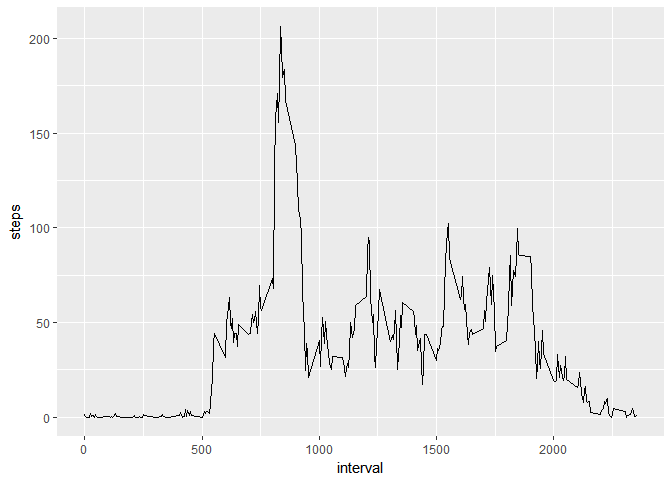
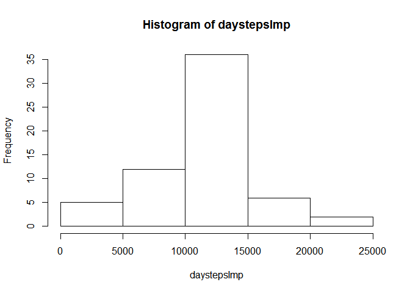

# Reproducible Research: Peer Assessment 1
In this project I have imported some data on the number of steps people take during several days. The number of steps in a 5 minute period and the date and time of that period have been recorded. I have explored the data using some simple operations as described below.


## Loading and preprocessing the data


```r
library(ggplot2)

setwd("~/Programming/Johns Hopkins Data Science/5 Reproducible research/Week 2")

activity <- read.csv("activity.csv", stringsAsFactors = FALSE)
```

## What is mean total number of steps taken per day?

daysteps is the total number of steps on each day (of which there are a total of 61). A histogram of this data is generated as well as the mean and median of this data. Note, that when calculating mean and median I excluded the zero values generated in daysteps by na.rm=TRUE (as these only occur on a subset of 8 days and nowhere else).


```r
daysteps <- tapply(activity$steps, activity$date, sum, na.rm = TRUE)

hist(daysteps)
```

<!-- -->


```r
meansteps <- mean(daysteps[daysteps > 0])
meansteps
```

```
## [1] 10766.19
```

```r
mediansteps <- median(daysteps[daysteps > 0])
mediansteps
```

```
## [1] 10765
```
## What is the average daily activity pattern?

The next tast was to find the mean number of steps in 5 minute intervals averaged over all days.

```r
minsteps <- aggregate(steps~interval, activity, mean, na.rm = TRUE)
```

This time series was plotted as follows:

```r
ggplot(minsteps, aes(interval, steps)) + geom_line()
```

<!-- -->

The 5 minute interval with the maximum number of steps is:

```r
minsteps[minsteps$steps == max(minsteps$steps),]
```

```
##     interval    steps
## 104      835 206.1698
```

## Imputing missing values
The following code was first used to find the total number of rows containing NAs.


```r
NAvals <- sapply(activity, function(x) sum(is.na(x)))
NAvals
```

```
##    steps     date interval 
##     2304        0        0
```

To impute these missing values, they were replaced with the previously calcuated mean for that time interval.


```r
## Creat new data frame in which to impute values
activeImp <- activity

## Loop over the data frame replacing as appropriate
for (i in 1:nrow(activity)){
  if (is.na(activity$steps[i])){
    activeImp$steps[i] <- minsteps[(minsteps$interval == activeImp$interval[i]), 2]
    }
}


## Check this operation has removed NA values
NAcheck <- sapply(activeImp, function(x) sum(is.na(x)))
NAcheck
```

```
##    steps     date interval 
##        0        0        0
```


I next recalculated the histogram, mean and median on the new imputed data set:


```r
daystepsImp <- tapply(activeImp$steps, activeImp$date, sum, na.rm = TRUE)

hist(daystepsImp)
```

<!-- -->


```r
meanstepsImp <- mean(daystepsImp)
meanstepsImp
```

```
## [1] 10766.19
```

```r
medianstepsImp <- median(daystepsImp)
medianstepsImp
```

```
## [1] 10766.19
```

These operations have no effect on the mean (as expected), but the median has been slightly adjusted to the mean as it now falls on one the imputed days (all imputed values occur on 8 days which contain all NA values).


## Are there differences in activity patterns between weekdays and weekends?

The final task was to assess how activity varied between weekdays and weekends. To acheive this I first created a new factor variable indicating which day of the week eah recorded date corresponded to, then looped over the data frame identifying which are weekdays and which on weekends.


```r
activeImp$date <- as.Date(activeImp$date)
weekDayImp <- as.factor(weekdays(activeImp$date))

for (i in 1:nrow(activeImp)){
  if ((weekDayImp[i] == "Saturday") | (weekDayImp[i] == "Sunday")){
    activeImp$dayType[i] <- "weekend"
  }
  else {
    activeImp$dayType[i] <- "weekday"
  }
}
```

I finally created a time series of the five minute interval averages for weekdays and weekends and plotted them on top of each other using ggplot.


```r
weekDaysteps <- aggregate(steps~interval, data = subset(activeImp, dayType == "weekday"), mean)
weekEndsteps <- aggregate(steps~interval, data = subset(activeImp, dayType == "weekend"), mean)
weekDaysteps$dayType = "weekday"
weekEndsteps$dayType = "weekend"
alldata <- rbind(weekDaysteps, weekEndsteps)

## Plot each timeseries
ggplot(alldata, aes(interval, steps)) + facet_grid(dayType ~ .) + geom_line()
```

<!-- -->

It can be seen that weekends and weekdays share a similar peak interval of activity, although the subjects were generally more active throughout the day on weekends.
